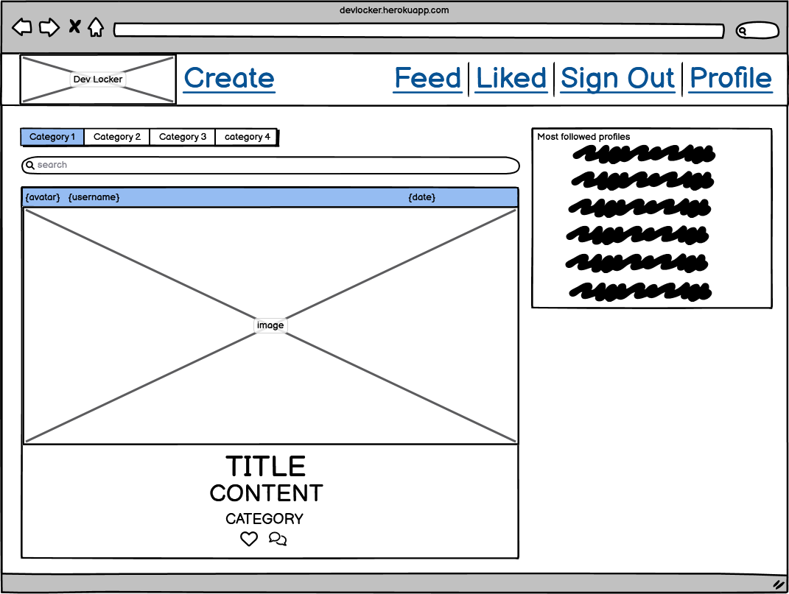
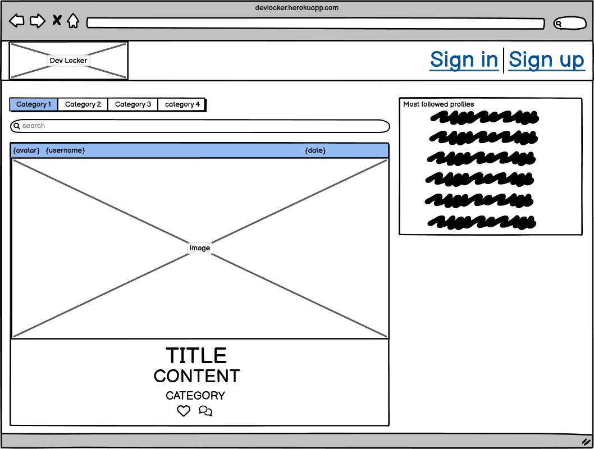
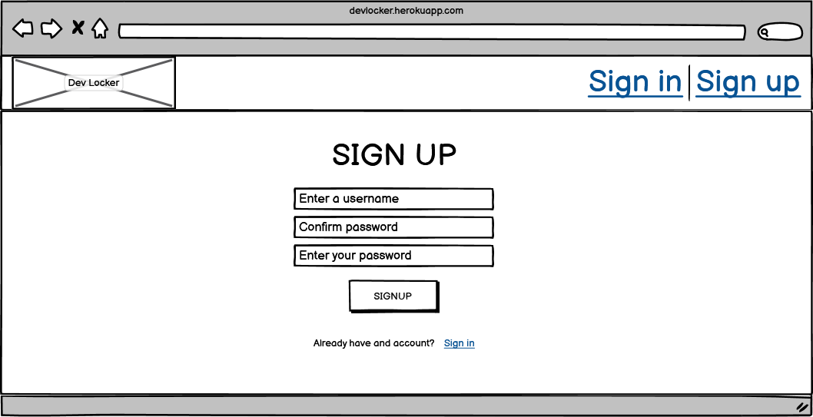
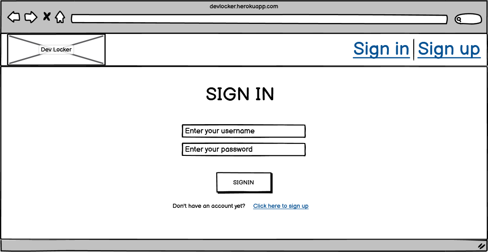
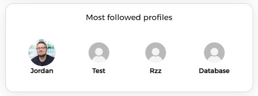
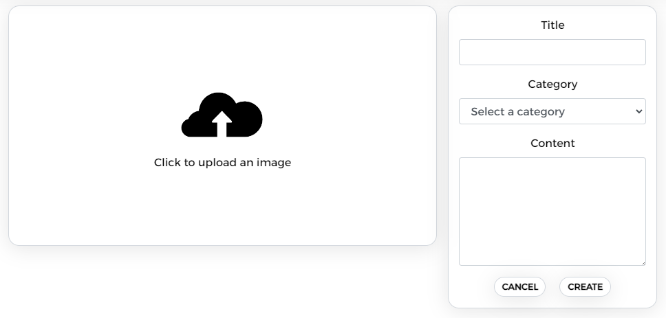
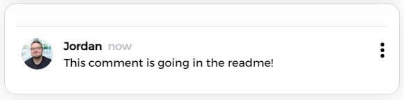

# DevLocker

<i>Developer: Jordan Brookfield</i>

[Live link](https://devlocker.herokuapp.com/)

[API repository](https://github.com/jrdnbrkfld/api)

## Table of Contents

- [Purpose](#purpose)
- [UX](#user-experience)
- [Features](#features)
- [Technologies](#technologies)
- [Testing](#testing)
- [Bugs](#bugs)
- [Validation](#validation)
- [Config](#config)
- [Credits](#credits)

# Milestone Project 5 - DevLocker

## Purpose

This website was created to complete the fifth Milestone Project for Code Insitute's Full Stack Software Developer course. I built this from the ground up using knowledge I gained from the previous modules. The objective of this project is to showcase my ability to create a true Full Stack application using the Django Rest framework for the backend and React for the frontend. The full list of technologies used can be found in the technologies section further down.


Users of this website are able to:

- Create, update and delete their own posts
- Create, update and delete their own comments
- Follow and unfollow other users
- Like and unlike posts
- Search for posts via keywords or username
- Filter posts by category

Please note: To open any links in this document in a new browser tab, please press CTRL + Click.

##### Back to [top](#table-of-contents)

# User Experience

<details><summary>User Stories</summary>

All of the user stories are shown below. If you would like to inspect them further, please click [this](https://github.com/users/jrdnbrkfld/projects/8/views/1?layout=table).


</details>

## Design

<details><summary>Colours</summary>

I decided to keep the colour scheme of the website simple and clean. The background, text and foreground colors have a sufficient contrast ratio to aid with accessibility.


</details>

<details><summary>Fonts</summary>

I used the [Alexandria](https://fonts.google.com/specimen/Alexandria?query=alexandria) for the entire website.


</details>

## Wireframes

<details><summary>Home Page</summary>

Home page signed in:



Home page signed out:



Home page mobile:


</details>

<details><summary>Sign Up</summary>

Desktop:



Mobile:


</details>

<details><summary>Sign In</summary>

Desktop:



Mobile:


</details>

<details><summary>Create</summary>

Desktop:


Mobile:


</details>

<details><summary>Profile</summary>

Desktop:


Mobile:


</details>

## Features

<details><summary>Home</summary>

The first thing users are greeted to is the Home Page. This is where you will find everything to navigate the website and decide wether or not you would like to take part and create an account. All of the posts are clickable so the user can inspect them further.

This targets the following user stories:

- [As a user I can view the details of a single post so that I can learn more about it](https://github.com/jrdnbrkfld/devlocker/issues/10)
- [As a user I can view all the most recent posts, ordered by most recently created first so that I am up to date with the newest content](https://github.com/jrdnbrkfld/devlocker/issues/12)
- [As a user I can view the posts page so that I can read the comments about the post](https://github.com/jrdnbrkfld/devlocker/issues/17)

Desktop view:


Mobile view:


</details>
<details><summary>Navbar</summary>
Featured at the top of all pages is the navbar, holding the DevLocker logo and the links to the Sign in and Sign up page while logged out.
If the user is logged in they can navigate to the Create, Feed, Liked, Sign out and Profile pages. On smaller screen sizes this turns into a toggler button.

This targets the following user stories:

- [As a user I can view a navbar from every page so that I can navigate easily between pages](https://github.com/jrdnbrkfld/devlocker/issues/1)
- [As a user I can navigate through pages quickly so that I can view content seamlessly without page refresh](https://github.com/jrdnbrkfld/devlocker/issues/2)
- [As a user I can tell if I am logged in or not so that I can log in if I need to](https://github.com/jrdnbrkfld/devlocker/issues/5)
- [As a logged out user I can see sign in and sign up options so that I can sign in/sign up](https://github.com/jrdnbrkfld/devlocker/issues/7)
- [As a user I can maintain my logged-in status until I choose to log out so that my user experience is not compromised](https://github.com/jrdnbrkfld/devlocker/issues/6)

Desktop view:


Mobile view:


Toggled view:


</details>
<details><summary>Sign up</summary>
If the visitor likes the website, they are able to register an account. This enables the user to be able to create posts, like posts and comment on posts. Once registered, the user is redirected to the sign in page.

This targets the following user story:

- [As a user I can create a new account so that I can access all the features for signed up users](https://github.com/jrdnbrkfld/devlocker/issues/3)


This page also handles any errors like blank fields or password not matching.


</details>
<details><summary>Sign in</summary>
When the user returns to the website, or come here after they have signed up they are able to log in. Both fields are mandatory and the correct error handling is in effect.

This targets the following user story:

- [As a user I can sign in to the app so that I can access functionality for logged in users](https://github.com/jrdnbrkfld/devlocker/issues/4)


</details>
<details><summary>Popular profiles</summary>
While viewing the website users are able to view other accounts that are popular, enabling them to decide if they would like to follow for more content. It contains follow buttons next to each user, with the ability to also unfollow.

This targets the following user story:

- [As a user I can see a list of the most followed profiles so that I can see which profiles are popular](https://github.com/jrdnbrkfld/devlocker/issues/25)




</details>
<details><summary>Search</summary>
Users are able to search via keywords or by username to give them the ability to specifically view posts related to their interests.

This targets the following user story:

- [As a user, I can search for posts with keywords, so that I can find the posts and user profiles I am most interested in.](https://github.com/jrdnbrkfld/devlocker/issues/13)


</details>
<details><summary>Categories</summary>
Users are able to filter posts by their category that was chosen when the post was created. This enables the user to find the content that they are most interested in.

This targets the following user story:

- [As a user I can filter and search for posts that have the related category I want to read about](https://github.com/jrdnbrkfld/devlocker/issues/31)


</details>
<details><summary>Create, edit and delete posts</summary>
Users are able to create their own posts including an image, title, content and category.

This targets the following user story:

- [As a logged in user I can create posts so that I can share my ideas with the world](https://github.com/jrdnbrkfld/devlocker/issues/9)



If changes need to be made they also have the ability to edit all fields for the post. Deletion is also enabled.

This targets the following user story:

- [As a post owner I can edit my post title and description so that I can make corrections or update my post after it was created](https://github.com/jrdnbrkfld/devlocker/issues/18)


</details>
<details><summary>Create, edit and delete comments</summary>
Users are able to create their own comments on posts.

This targets the following user stories:

- [As a logged in user I can add comments to a post so that I can share my thoughts about the post](https://github.com/jrdnbrkfld/devlocker/issues/19)
- [As a user I can see how long ago a comment was made so that I know how old a comment is](https://github.com/jrdnbrkfld/devlocker/issues/20)
- [As a user I can read comments on posts so that I can read what other users think about the posts](https://github.com/jrdnbrkfld/devlocker/issues/21)



If changes need to be made they also have the ability to edit the comment, or delete it.

This targets the following user stories:

- [As an owner of a comment I can delete my comment so that I can control removal of my comment from the application](https://github.com/jrdnbrkfld/devlocker/issues/22)
- [As an owner of a comment I can edit my comment so that I can fix or update my existing comment](https://github.com/jrdnbrkfld/devlocker/issues/23)


</details>

<details><summary>Likes</summary>
Users are able to like posts that they enjoy. This directly affects the 'Liked' section of the website, which shows only the posts that the user has liked previously.

This targets the following user stories:

- [As a logged in user I can like a post so that I can show my support for the posts that interest me](https://github.com/jrdnbrkfld/devlocker/issues/11)
- [As a logged in user I can view the posts I liked so that I can find the posts I enjoy the most](https://github.com/jrdnbrkfld/devlocker/issues/14)


</details>

<details><summary>Feed</summary>
With the addition of being able to follow users, when the 'Feed' section of the website is visited it will show posts from the authors the user has followed.

This targets the following user stories:

- [As a logged in user I can view content filtered by users I follow so that I can keep up to date with what they are posting about](https://github.com/jrdnbrkfld/devlocker/issues/15)
- [As a user I can view all the posts by a specific user so that I can catch up on their latest posts, or decide I want to follow them](https://github.com/jrdnbrkfld/devlocker/issues/28)
- [As a logged in user I can follow and unfollow other users so that I can see and remove posts by specific users in my posts feed](https://github.com/jrdnbrkfld/devlocker/issues/27)

</details>

<details><summary>Infinite Scroll</summary>
To aid with the user experience an infinite scroll component was used instead of the standard pagination.

This targets the following user story:

- [As a user I can keep scrolling through the images on the site, that are loaded for me automatically so that I don't have to click on "next page" etc](https://github.com/jrdnbrkfld/devlocker/issues/16)

</details>

<details><summary>Profile</summary>
When users visit this section they can view their personal statistics:

- How many posts they have created
- How many followers they have
- How many people they follow
- A small bio section where users can enter a quick description of themselves.

This targets the following user stories:

- [As a user I can view user's avatars so that I can easily identify users of the application](https://github.com/jrdnbrkfld/devlocker/issues/8)
- [As a user I can view other users profiles so that I can see their posts and learn more about them](https://github.com/jrdnbrkfld/devlocker/issues/24)
- [As a user I can view statistics about a specific user: bio, number of posts, follows and users followed so that I can learn more about them](https://github.com/jrdnbrkfld/devlocker/issues/26)


Clicking the 3 dots creates a dropdown menu with the options to:

- Edit profile
- Change username
- Change password

This targets the following user stories:

- [As a logged in user I can edit my profile so that I can change my profile picture and bio](https://github.com/jrdnbrkfld/devlocker/issues/29)
- [As a logged in user I can update my username and password so that I can change my display name and keep my profile secure](https://github.com/jrdnbrkfld/devlocker/issues/30)


</details>

## Future Features

A list of ideas that I would like to implement in the future are as follow:

- Posting videos instead of images
- Show most liked posts, similiar to the popular profiles section
- Ability to reply to comments
- Option to like/unlike comments

##### Back to [top](#table-of-contents)

# Technologies

- [HTML](https://html.spec.whatwg.org/multipage/)
- [CSS](https://www.w3.org/Style/CSS/Overview.en.html)
- [JavaScript](https://www.javascript.com/)
- [React.js](https://reactjs.org/)
- [Axios](https://axios-http.com/docs/intro)
- [React-Bootstrap](https://react-bootstrap-v4.netlify.app/)
- [Heroku](https://dashboard.heroku.com/) - the site used to deploy the project.
- [GitHub](https://github.com/) - the hosting site I used to store the code for the website.
- [GitPod](https://gitpod.io/) - the Integrated Development Environment used to develop the website in a browser.
- [Font Awesome](https://fontawesome.com/) - icons are used for all of the icons located throughout the website.
- [Google Fonts](https://fonts.google.com/) - are used in the project to import the **Alexandria** font.
- [Chrome Developer Tools](https://developer.chrome.com/docs/devtools/) - the built in developer tools in Google Chrome are used to test CSS styles, inspect page elements, React components and help with debugging problems with the layout of the website.
- [Stack Overflow](https://stackoverflow.com/) - Stack Overflow was the primary source for help regarding issues.
- [W3 Schools](https://www.w3schools.com/) - W3 Schools was one of the websites used for resolving issues with code.

##### Back to [top](#table-of-contents)

# Testing

## Manual testing

I tested that the website is responsive, functions well and looks good on all screen sizes using Google Dev Tools and Responsive Design Checker.

<details><summary>Google Sheets</summary>


</details>

##### Back to [top](#table-of-contents)

# Validation

<details><summary>HTML</summary>

Returned with no errors. However it did throw the following:

`Trailing slash on void elements has no effect and interacts badly with unquoted attribute values.`

This is due to React, which was completely unavoidable.


</details>

## CSS

## JSX

## Wave

## Lighthouse

##### Back to [top](#table-of-contents)

# Config

### Forking the GitHub Repository

1. Go to the GitHub repository
2. Click on Fork button in top right corner
3. You will then have a copy of the repository in your own GitHub account.

### Making a Local Clone

1. Go to the GitHub repository
2. Locate the Code button above the list of files and click it
3. Highlight the "HTTPS" button to clone with HTTPS and copy the link
4. Open commandline interface on your computer
5. Change the current working directory to the one where you want the cloned directory
6. Type git clone and paste the URL from the clipboard

```
$ git clone https://github.com/aleksandracodes/ci_pp5_snapfood.git
```

7. Press Enter to create your local clone

##### Back to [top](#table-of-contents)

# Credits
